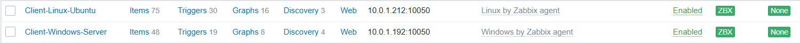
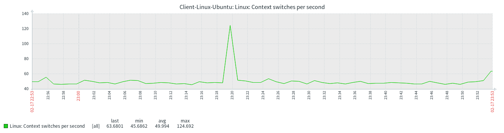

# 🚀 TP AWS: Infrastructure de Monitoring Centralisé avec Zabbix

[](https://aws.amazon.com)
[](https://www.docker.com)
[](https://www.zabbix.com)
[](https://ubuntu.com)
[](https://www.microsoft.com/windows-server)

## 📋 Table des Matières
- [Description du Projet](#-description-du-projet)
- [Architecture](#-architecture)
- [Prérequis](#-prérequis)
- [Structure du Projet](#-structure-du-projet)
- [Guide d'Installation Pas à Pas](#-guide-dinstallation-pas-à-pas)
  - [1. Configuration AWS](#1-configuration-aws)
  - [2. Déploiement des Instances EC2](#2-déploiement-des-instances-ec2)
  - [3. Installation du Serveur Zabbix](#3-installation-du-serveur-zabbix)
  - [4. Configuration des Agents](#4-configuration-des-agents)
  - [5. Configuration de Zabbix](#5-configuration-de-zabbix)
- [Dépannage](#-dépannage)
- [Résultats](#-résultats)
- [Auteur](#-auteur)
- [Licence](#-licence)

## 🎯 Description du Projet

Ce projet a été réalisé dans le cadre d'un Travail Pratique visant à déployer une **infrastructure de monitoring centralisée sur AWS** en utilisant **Zabbix conteneurisé avec Docker** pour surveiller un **parc hybride (Linux & Windows)**.

### Objectifs Pédagogiques
- Maîtriser le déploiement d'infrastructure sur AWS (VPC, EC2, Security Groups)
- Comprendre la conteneurisation d'applications avec Docker
- Mettre en place une solution de monitoring professionnelle (Zabbix)
- Configurer la supervision d'un parc hétérogène

## 🏗 Architecture

### Architecture Réseau
```
┌─────────────────────────────────────────────────────────────┐
│                         VPC (10.0.0.0/16)                   │
│                                                             │
│  ┌─────────────────────────────────────────────────────┐    │
│  │              Sous-réseau Public (10.0.1.0/24)       │    │
│  │                                                     │    │
│  │  ┌──────────────────┐  ┌──────────────────┐         │    │
│  │  │  Serveur Zabbix  │  │   Client Linux   │         │    │
│  │  │    t3.large      │  │    t3.medium     │         │    │
│  │  │   Ubuntu 22.04   │  │   Ubuntu 22.04   │         │    │
│  │  └────────┬─────────┘  └────────┬─────────┘         │    │
│  │           │                     │                   │    │
│  │  ┌────────▼─────────────────────▼─────────┐         │    │
│  │  │         Client Windows                 │         │    │
│  │  │           t3.large                     │         │    │
│  │  │      Windows Server 2022               │         │    │
│  │  └────────────────────────────────────────┘         │    │
│  │                                                     │    │
│  └─────────────────────────────────────────────────────┘    │
│                                                             │
│        ┌──────────────────────┐                             │
│        │  Internet Gateway    │                             │
│        └──────────┬───────────┘                             │
└───────────────────┼─────────────────────────────────────────┘
                    │
              ┌─────▼─────┐
              │  Internet │
              └───────────┘
```

### Flux de Données
```
Client Linux ──(port 10050)──┐
                              ├──► Serveur Zabbix (port 10051)
Client Windows ──(port 10050)─┘          │
                                          │ (port 80/443)
                                    ┌─────▼────────┐
                                    │  Utilisateur │
                                    └──────────────┘
```

## 📦 Prérequis

### Comptes et Outils
- [x] Compte AWS (avec accès AWS Learner Lab ou crédits)
- [x] Client SSH (Terminal, PuTTY, ou Windows Terminal)
- [x] Client RDP (pour accès Windows)
- [x] Navigateur web moderne
- [x] Git (pour cloner le dépôt)

### Connaissances Recommandées
- Bases de Linux (commandes shell)
- Notions de réseau (TCP/IP, ports)
- Concepts de base du cloud computing

## 📁 Structure du Projet

```
tp-zabbix-aws/
├── README.md                 # Ce fichier
├── docker-compose.yml        # Configuration Docker pour Zabbix
├── scripts/
│   ├── install-docker.sh     # Script d'installation Docker
│   ├── setup-linux-agent.sh   # Script installation agent Linux
│   └── setup-windows-agent.ps1 # Script PowerShell pour Windows
├── configs/
│   ├── zabbix_agentd.linux.conf  # Template config agent Linux
│   └── zabbix_agentd.windows.conf # Template config agent Windows
├── docs/
│   ├── architecture-diagram.png  # Diagramme d'architecture
│   └── TP_Zabbix_AWS_Rapport.pdf # Rapport final
└── screenshots/              # Captures d'écran du TP
    ├── 01-vpc-creation.png
    ├── 02-security-groups.png
    ├── 03-ec2-instances.png
    ├── 04-docker-deployment.png
    ├── 05-zabbix-login.png
    ├── 06-zabbix-dashboard.png
    ├── 07-linux-agent-config.png
    ├── 08-windows-agent-install.png
    ├── 09-hosts-green.png
    └── 10-cpu-graph.png
```

## 🔧 Guide d'Installation Pas à Pas

### 1. Configuration AWS

#### 1.1 Création du VPC
```bash
# Via Console AWS ou AWS CLI
aws ec2 create-vpc --cidr-block 10.0.0.0/16 --tag-specifications 'ResourceType=vpc,Tags=[{Key=Name,Value=TP-Zabbix-VPC}]'
```

#### 1.2 Création du Sous-réseau Public
```bash
aws ec2 create-subnet --vpc-id vpc-xxxxx --cidr-block 10.0.1.0/24 --availability-zone us-east-1a
```

#### 1.3 Configuration de la Passerelle Internet
```bash
aws ec2 create-internet-gateway
aws ec2 attach-internet-gateway --vpc-id vpc-xxxxx --internet-gateway-id igw-xxxxx
```

#### 1.4 Configuration des Groupes de Sécurité

**SG_Serveur_Zabbix:**
| Type | Protocole | Port | Source | Description |
|------|-----------|------|--------|-------------|
| SSH | TCP | 22 | 0.0.0.0/0 | Accès administrateur |
| HTTP | TCP | 80 | 0.0.0.0/0 | Interface web Zabbix |
| Custom TCP | TCP | 10050 | 0.0.0.0/0 | Agent Zabbix |
| Custom TCP | TCP | 10051 | 0.0.0.0/0 | Trafic Zabbix |

**SG_Clients:**
| Type | Protocole | Port | Source | Description |
|------|-----------|------|--------|-------------|
| SSH | TCP | 22 | 0.0.0.0/0 | Accès Linux |
| RDP | TCP | 3389 | 0.0.0.0/0 | Accès Windows |
| Custom TCP | TCP | 10050 | IP Serveur | Agent Zabbix |

### 2. Déploiement des Instances EC2

#### 2.1 Serveur Zabbix (Ubuntu 22.04 - t3.large)
```bash
# Connexion SSH
ssh -i votre-cle.pem ubuntu@<IP_PUBLIQUE_SERVEUR>
```

#### 2.2 Client Linux (Ubuntu 22.04 - t3.medium)
```bash
# Connexion SSH
ssh -i votre-cle.pem ubuntu@<IP_PUBLIQUE_CLIENT_LINUX>
```

#### 2.3 Client Windows (Windows Server 2022 - t3.large)
- Récupérer le mot de passe administrateur depuis la console AWS
- Se connecter via RDP

### 3. Installation du Serveur Zabbix

#### 3.1 Installation de Docker et Docker Compose
```bash
# Télécharger et exécuter le script
wget -O scripts/install-docker.sh https://raw.githubusercontent.com/.../install-docker.sh
chmod +x scripts/install-docker.sh
./scripts/install-docker.sh
```

**Script install-docker.sh:**
```bash
#!/bin/bash
# Mise à jour du système
sudo apt update && sudo apt upgrade -y

# Installation de Docker
sudo apt install docker.io -y
sudo systemctl start docker
sudo systemctl enable docker

# Installation de Docker Compose
sudo apt install docker-compose -y

# Ajout de l'utilisateur au groupe docker
sudo usermod -aG docker $USER

# Vérification
docker --version
docker-compose --version
```

#### 3.2 Déploiement avec Docker Compose
```bash
# Créer le répertoire de travail
mkdir ~/zabbix-docker && cd ~/zabbix-docker

# Copier le fichier docker-compose.yml
cp ../docker-compose.yml .

# Lancer les conteneurs
docker-compose up -d

# Vérifier l'état
docker-compose ps
```

**docker-compose.yml:**
```yaml
version: '3.5'
services:
  mysql-server:
    image: mysql:8.0
    container_name: zabbix-mysql
    command: --character-set-server=utf8mb4 --collation-server=utf8mb4_unicode_ci
    volumes:
      - ./zabbix-mysql-data:/var/lib/mysql
    environment:
      MYSQL_DATABASE: 'zabbix'
      MYSQL_USER: 'zabbix'
      MYSQL_PASSWORD: 'zabbix_pwd'
      MYSQL_ROOT_PASSWORD: 'root_pwd'
    restart: always
    networks:
      - zbx_network

  zabbix-server:
    image: zabbix/zabbix-server-mysql:alpine-6.4-latest
    container_name: zabbix-server
    environment:
      DB_SERVER_HOST: 'mysql-server'
      MYSQL_DATABASE: 'zabbix'
      MYSQL_USER: 'zabbix'
      MYSQL_PASSWORD: 'zabbix_pwd'
      MYSQL_ROOT_PASSWORD: 'root_pwd'
    ports:
      - "10051:10051"
    depends_on:
      - mysql-server
    restart: always
    networks:
      - zbx_network

  zabbix-web:
    image: zabbix/zabbix-web-nginx-mysql:alpine-6.4-latest
    container_name: zabbix-web
    environment:
      ZBX_SERVER_HOST: 'zabbix-server'
      DB_SERVER_HOST: 'mysql-server'
      MYSQL_DATABASE: 'zabbix'
      MYSQL_USER: 'zabbix'
      MYSQL_PASSWORD: 'zabbix_pwd'
      MYSQL_ROOT_PASSWORD: 'root_pwd'
      PHP_TZ: 'Europe/Paris'
    ports:
      - "80:8080"
    depends_on:
      - mysql-server
      - zabbix-server
    restart: always
    networks:
      - zbx_network

networks:
  zbx_network:
    driver: bridge
```

### 4. Configuration des Agents

#### 4.1 Agent Linux

**Script d'installation (setup-linux-agent.sh):**
```bash
#!/bin/bash
# Variables
SERVER_IP="$1"  # IP privée du serveur Zabbix

if [ -z "$SERVER_IP" ]; then
    echo "Usage: $0 <SERVER_IP>"
    exit 1
fi

# Installation du dépôt Zabbix
wget https://repo.zabbix.com/zabbix/6.4/ubuntu/pool/main/z/zabbix-release/zabbix-release_6.4-1+ubuntu22.04_all.deb
sudo dpkg -i zabbix-release_6.4-1+ubuntu22.04_all.deb
sudo apt update

# Installation de l'agent
sudo apt install zabbix-agent -y

# Configuration
sudo sed -i "s/^Server=127.0.0.1/Server=$SERVER_IP/" /etc/zabbix/zabbix_agentd.conf
sudo sed -i "s/^ServerActive=127.0.0.1/ServerActive=$SERVER_IP/" /etc/zabbix/zabbix_agentd.conf
sudo sed -i "s/^Hostname=.*/Hostname=Client-Linux-Ubuntu/" /etc/zabbix/zabbix_agentd.conf

# Démarrage du service
sudo systemctl restart zabbix-agent
sudo systemctl enable zabbix-agent

# Vérification
sudo systemctl status zabbix-agent
```

**Exécution:**
```bash
chmod +x scripts/setup-linux-agent.sh
./scripts/setup-linux-agent.sh <IP_PRIVEE_SERVEUR>
```

#### 4.2 Agent Windows

**Script PowerShell (setup-windows-agent.ps1):**
```powershell
param(
    [Parameter(Mandatory=$true)]
    [string]$ServerIP
)

# Téléchargement de l'agent Zabbix
$url = "https://cdn.zabbix.com/zabbix/binaries/stable/6.4/6.4.0/zabbix_agent-6.4.0-windows-amd64-openssl.msi"
$output = "C:\temp\zabbix_agent.msi"

# Création du dossier temp
New-Item -ItemType Directory -Force -Path "C:\temp"

# Téléchargement
Invoke-WebRequest -Uri $url -OutFile $output

# Installation silencieuse
msiexec /i $output /qn /norestart \
    HOSTNAME=Client-Windows-Server \
    SERVER=$ServerIP \
    SERVERACTIVE=$ServerIP \
    ENABLEREMOTECOMMANDS=1

# Démarrage du service
Start-Service "Zabbix Agent"
Set-Service "Zabbix Agent" -StartupType Automatic

Write-Host "Agent Zabbix installé avec succès!" -ForegroundColor Green
```

### 5. Configuration de Zabbix

#### 5.1 Accès à l'interface web
- Ouvrir un navigateur: `http://<IP_PUBLIQUE_SERVEUR>`
- Identifiants par défaut: **Admin** / **zabbix**

#### 5.2 Ajout des hôtes

**Via l'interface web:**
1. Aller dans **Configuration → Hôtes**
2. Cliquer sur **Créer un hôte**
3. Remplir les informations:
   - **Nom**: Client-Linux-Ubuntu
   - **Groupes**: Linux Servers
   - **Interface**: Agent (IP privée du client, port 10050)
   - **Modèles**: Linux by Zabbix agent

**Via l'API Zabbix (automatisation):**
```bash
# Exemple avec curl (à adapter)
curl -X POST -H "Content-Type: application/json" -d '{
    "jsonrpc": "2.0",
    "method": "host.create",
    "params": {
        "host": "Client-Linux-Ubuntu",
        "interfaces": [{
            "type": 1,
            "main": 1,
            "useip": 1,
            "ip": "<IP_CLIENT>",
            "dns": "",
            "port": "10050"
        }],
        "groups": [{"groupid": "2"}],
        "templates": [{"templateid": "10001"}]
    },
    "auth": "token",
    "id": 1
}' http://<IP_SERVEUR>/api_jsonrpc.php
```

## 🔍 Dépannage

### Problèmes Courants et Solutions

#### 1. Les hôtes restent en gris (non disponibles)
```bash
# Vérifier que l'agent tourne
sudo systemctl status zabbix-agent

# Tester la connexion depuis le serveur
telnet <IP_CLIENT> 10050

# Vérifier les logs
sudo tail -f /var/log/zabbix/zabbix_agentd.log
```

#### 2. Les conteneurs Docker ne démarrent pas
```bash
# Vérifier les logs
docker-compose logs

# Vérifier l'espace disque
df -h

# Redémarrer Docker
sudo systemctl restart docker
docker-compose up -d
```

#### 3. Problèmes de connectivité réseau
```bash
# Vérifier les règles des Security Groups
# Vérifier que l'IP utilisée est bien l'IP PRIVEE
# Tester le ping
ping <IP_PRIVEE_CLIENT>
```

## 📊 Résultats

### Captures d'écran clés

#### Interface Zabbix - Dashboard principal


#### Hôtes avec statut vert


#### Graphique de monitoring


## 👨‍💻 Auteur

El Abssi Sami
- 📧 Email: s.abssi@hestim.ma
- 🔗 GitHub: [@samielabssi](https://github.com/samielabssi)

## 📄 Licence

Ce projet a été réalisé dans le cadre pédagogique du TP "Mise en œuvre d'une infrastructure cloud de supervision centralisée sous AWS". Tous droits réservés © 2025-2026.

---

## 🙏 Remerciements

- **Prof. Azeddine KHIAT** pour l'encadrement et les conseils
- **AWS Academy** pour la mise à disposition du Learner Lab
- La communauté **Zabbix** et **Docker** pour leur documentation exhaustive

---

⭐ N'hésitez pas à me contacter si vous avez des questions ou suggestions d'amélioration !
